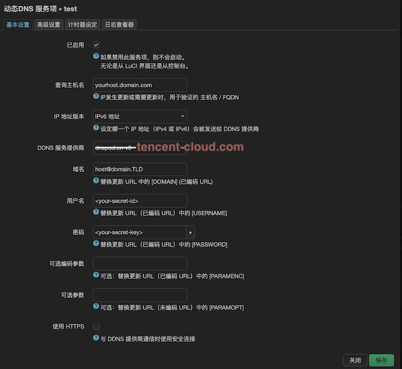

# Openwrt DDNS Script: 腾讯云 Tencent Cloud (原 DNSPod)

使用最新的腾讯云 APIv3 实现 (Dnspod API 已经不再维护并且不知道什么时候会下线),
为 `ddns-scripts` 增加对腾讯云的支持.

- 同时支持 IPv4 / IPv6
- 支持更新解析值 / 为新域名增加解析 (新增需保证查询主机名为被解析域名).

## 安装

编译到 Openwrt:

- 下载 `Openwrt` 源码并编译
- 执行 `make menuconfig` 并选择该 package
- 执行 `make package/ddns-scripts_tencent_cloud/compile V=99`.

或直接将文件复制到目录:

1. `cp update_tencent_cloud_com.sh /usr/lib/ddns/update_tencent_cloud_com.sh`
2. `cp tencent-cloud.com.json /usr/share/ddns/default/tencent-cloud.com.json`

## 使用方法

> 脚本编写时的版本如下:
>
> - `ddns-scripts == 2.8.2-43`
> - `luci-app-ddns == git-24.313.38121-76e4eca`

1. 导航到 `服务 (Services) -> 动态 DNS (Dynamic DNS)`
2. 点击 `添加新服务... (Add new services...)`
3. 基本设置 (Basic Settings)
   1. 查询主机地址 (Lookup Hostname): 填写一个已经被解析的地址, 可以在服务提供商处先添加一条解析记录.
   2. IP 地址版本 (IP address version): 根据需求选择 v4 / v6.
   3. DDNS 服务提供商 (DDNS Service provider): 选择 `tencent-cloud.com`.
   4. 域名 (Domain): 填写格式 `hostname@yourdomain.TLD`,
      e.g. `@example.com` (解析为 `example.com`), `mail@example.com` (解析为 `mail.example.com`)
   5. 用户名 (Username) / 密码 (Password): 对应 `SecretId` 与 `SecretKey`,
      去 [API 密钥管理](https://console.cloud.tencent.com/cam/capi) 申请, 只支持**长期密钥**.

其他选项按自己需要添加或修改.

> 注: **域名 (Domain)** 与 **查询主机地址 (Lookup Hostname)** 不一定要相同,
> 比如可以在查询主机地址上填写 `example.com`, 在域名处填写 `mail@exmaple.com`,
> 脚本会自动为 `mail@exmaple.com` 创建一条解析. 不过 `查询主机地址` **一定** 要填写一个已被解析的域名,
> `ddns-scripts` 主脚本会根据 `查询主机地址` 返回的解析结果决定是否要运行该更新脚本.

## 调试

```shell
# replace test with your service name
root@openwrt:/usr/lib/ddns# ./dynamic_dns_updater.sh -S test -v2 start
 201503       : ************ ************** ************** **************
 201503  note : PID '1609' started at 2024-11-16 20:15
 201503       : ddns version  : 2.8.2-43
 201503       : uci configuration:
ddns.test.check_unit='minutes'
ddns.test.domain='test@example.com'
ddns.test.enabled='1'
ddns.test.force_unit='minutes'
ddns.test.interface='wan'
ddns.test.ip_network='wan'
ddns.test.ip_source='network'
ddns.test.lookup_host='example.com'
ddns.test.password='****************************'
ddns.test.retry_unit='seconds'
ddns.test.service_name='tencent-cloud.com'
ddns.test.use_ipv6='0'
ddns.test.use_syslog='2'
ddns.test.username='*****************************'
ddns.test=service
 201503       : verbose mode  : 2 - run once, NO retry on error
 201503       : check interval: 600 seconds
 201503       : force interval: 4320 seconds
 201503       : retry interval: 60 seconds
 201503       : retry max count : 0 times
 201503       : No old process
 201503       : last update: 2024-11-16 12:44
 201503       : Detect registered/public IP
 201503       : #> /usr/bin/nslookup example.com  >/var/run/ddns/test.dat 2>/var/run/ddns/test.err
 201509       : Registered IP 'xxx.xxx.xxx.xxx' detected
 201509  info : Starting main loop at 2024-11-16 20:15
 201509       : Detect current IP on 'network'
 201509       : Current IP 'xxx.xxx.xxx.xxx' detected on network 'wan'
 201509       : Forced Update - L: 'xxx.xxx.xxx.xxx' == R: 'xxx.xxx.xxx.xxx'
 201509       : parsing script '/usr/lib/ddns/update_tencent_cloud_com.sh'
 201509       : #> /usr/bin/curl -RsS -o /var/run/ddns/test.dat --stderr /var/run/ddns/test.err --noproxy '*' --request POST https://dnspod.tencentcloudapi.com --data '{"Domain":"example.com","Offset":0,"Limit":1,"RecordType":"A","Subdomain":"test"}' --header 'HOST: dnspod.tencentcloudapi.com' --header 'Content-Type: application/json' --header 'X-TC-Action: DescribeRecordList' --header 'X-TC-Version: 2021-03-23' --header 'X-TC-Timestamp: 1731759309' --header 'Authorization: TC3-HMAC-SHA256 Credential=****************************/2024-11-16/dnspod/tc3_request, SignedHeaders=content-type;host;x-tc-action, Signature=99de0d8ef9ff7eb076d587749f1f15b4ea86da6bd171c927de5d035efdca1cc7'
 201510       : Got record id:
 201510       : #> /usr/bin/curl -RsS -o /var/run/ddns/test.dat --stderr /var/run/ddns/test.err --noproxy '*' --request POST https://dnspod.tencentcloudapi.com --data '{"Domain":"example.com","RecordType":"A","RecordLine":"默认","Value":"xxx.xxx.xxx.xxx","SubDomain":"test"}' --header 'HOST: dnspod.tencentcloudapi.com' --header 'Content-Type: application/json' --header 'X-TC-Action: CreateRecord' --header 'X-TC-Version: 2021-03-23' --header 'X-TC-Timestamp: 1731759310' --header 'Authorization: TC3-HMAC-SHA256 Credential=****************************/2024-11-16/dnspod/tc3_request, SignedHeaders=content-type;host;x-tc-action, Signature=a9f0a992f4f490d8a8017d4e9d40ef886346b23fa7939cebee47d795ae7fcf12'
 201511  info : Forced update successful - IP: 'xxx.xxx.xxx.xxx' send
 201511       : Waiting 600 seconds (Check Interval)
 201514  note : PID '1609' terminated by 'SIGINT' at 2024-11-16 20:15
```

## 举例



## 感谢

- [ddns-scripts_dnspod](https://github.com/nixonli/ddns-scripts_dnspod) 为脚本编写提供灵感.
- [ddn-scripts/update_cloudflare_com_v4.sh](https://github.com/openwrt/packages/blob/openwrt-23.05/net/ddns-scripts/files/usr/lib/ddns/update_cloudflare_com_v4.sh) 为脚本编写提供框架可部分代码.
- [ddns-scripts/Makefile](https://github.com/openwrt/packages/blob/openwrt-23.05/net/ddns-scripts/Makefile) 为 Makefile 提供代码框架.
